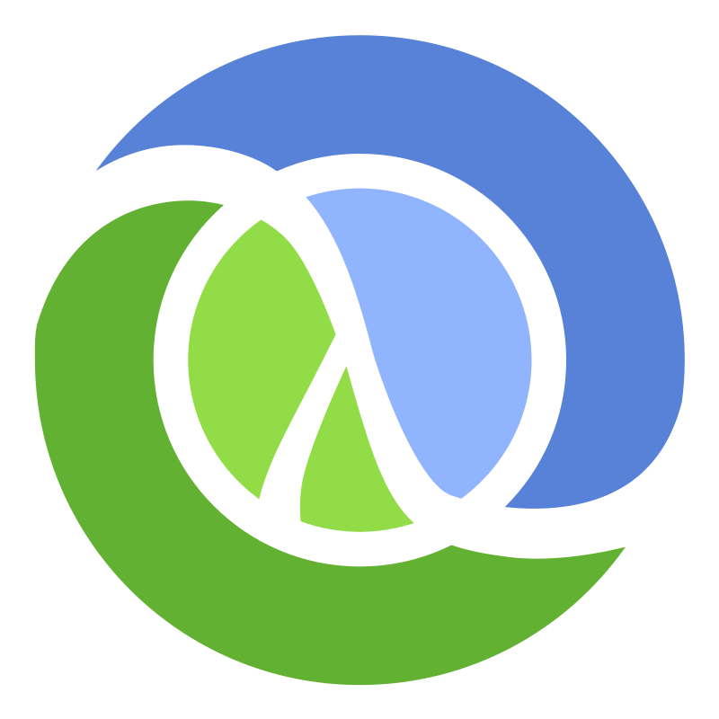

<h1 align="left" id = "dexto-title"> 👋🌎I'm Dikshith Shetty!</h1>

<h3 align="left"> I am a Software Engineer </h3>

 In general, I do Requirement Analysis, code developement, unit testing, integration testing, code review, Prod deployments/maintenance/support. 

  
  
  
  
  
  
  

- :office: &nbsp;I'm currently not working, looking for new opportunities.
- :seedling: &nbsp;I’m currently working on web3 **[project_name]**
- :book: &nbsp;Learn more about my projects on my **[blog]**
- :mailbox: &nbsp;Ask me anything on my **[issues page]**
- :computer: &nbsp;Connect with me on **[LinkedIn]**

<h2 align="left" id="dexto-tech">Favorite Tech</h2>

> Tools, languages, and other things that I like to work with.

<table>
  <tr>
    <td align="center" width="96">
      
       Java 
    </td>
    <td align="center" width="96">
      
       Spring
    </td>
    <td align="center" width="96">
      
       Python
    </td>
    <td align="center" width="96">
      
       JavaScript
    </td>
    <td align="center" width="96">
      
       Clojure
    </td>
    <td align="center" width="96"> 
      
       MySQL
    </td>
    <td align="center" width="96"> 
      
       Redis
    </td>
    </tr>
    <tr>
    <td align="center" width="96">
      
       Kubernetes
    </td>
    <td align="center" width="96"> 
      
       Docker
    </td>
    <td align="center"  width="96">
      
       Linux
    </td>
    <td align="center" width="96">
      
       Grafana
    </td>
    <td align="center" width="96">
      
       Prometheus
    </td>
    <td align="center" width="96">
      
       Terraform
    </td>
  </tr>
</table>

